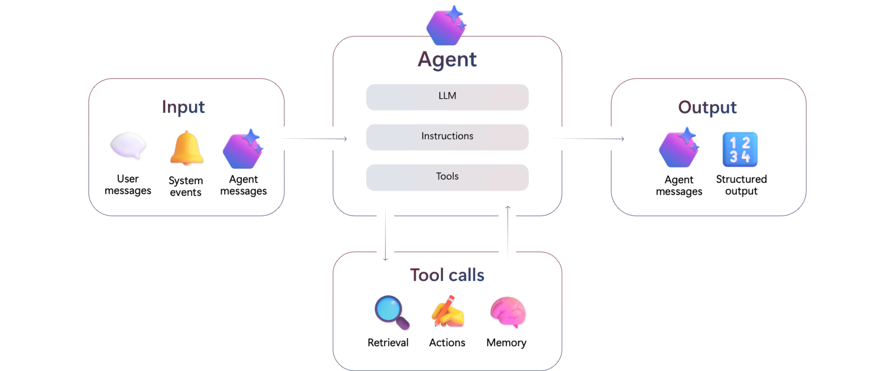

# Basic Agent Demo

## What is an Agent

An agent can be defined as the encapsulation of an LLM, instructions, and tools. This combination makes agents very versatile and even able to act autonomously. 



## Demo Overview

This demo demonstrates Semantic Kernel's Agent Framework. In it, we create use the previously defined LightsPlugin to create an agent that can manage the smart lighting system in a home.

## Final Code Snippet 

Replace the code in `Program.cs` with the snippet below to try this demo!

```csharp
using System.ComponentModel;
using Azure.Identity;
using lpe_ai_academy_sk_demo.Plugins;
using Microsoft.SemanticKernel;
using Microsoft.SemanticKernel.Agents;
using Microsoft.SemanticKernel.ChatCompletion;
using Microsoft.SemanticKernel.Connectors.AzureOpenAI;
using Spectre.Console;

string aoiEndpoint = "https://ai-hubdadecook825146559413.openai.azure.com/";

IKernelBuilder kernelBuilder = Kernel.CreateBuilder()
   .AddAzureOpenAIChatCompletion("gpt-4.1-mini", aoiEndpoint, new AzureCliCredential(), serviceId: "chat");

Kernel kernel = kernelBuilder.Build();

// Import the LightsPlugin into the kernel
kernel.ImportPluginFromType<LightsPlugin>();

// Get the chat service from the kernel's service provider
IChatCompletionService chatService = kernel.GetRequiredService<IChatCompletionService>("chat");

// Enable tool calling
AzureOpenAIPromptExecutionSettings settings = new() { FunctionChoiceBehavior = FunctionChoiceBehavior.Auto() };

// Create agent definition for the LightingAgent
ChatCompletionAgent agent =
	new()
	{
		Name = "LightingAgent",
		Instructions = """
			You are an agent designed to manage the smart lighting system in a home. 
			can perform various tasks related to the lights, such as adding, removing, listing, and updating lights.
			can also retrieve the current state of the lights and their colors.

			When adding a light:
			- If a user does not specify a color, you should default to "white"
			- If a user does not specify a state, you should default to "off"
		""",
		Kernel = kernel,
		Arguments = new KernelArguments(settings)
	};

ChatHistoryAgentThread agentThread = new();

while (true)
{
	// Get input from the user
	var userMessage = AnsiConsole.Ask<string>("> ");

	// Check if the user wants to exit
	if (userMessage.Equals("exit", StringComparison.OrdinalIgnoreCase))
	{
		break;
	}

	await foreach (ChatMessageContent response in agent.InvokeAsync(userMessage, agentThread))
	{
		// Display the agents's response
		AnsiConsole.MarkupLineInterpolated($"[aqua]> {response.Content}[/]");
	}
}
```